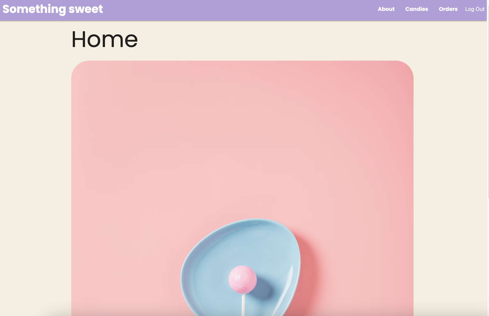

# Something sweet - Candy store - Django & PostgreSQL
Something sweet is a web page where users can 'buy' candies from different
countries. 
It starts at the home page and read about the site. 
If a user would like to see the candies, it would be necessary for them 
to either sign up or log in. Once in their account, users can browse 
the candy options, click on the images or name to read more about the item; 
in this case name, country, a brief description and cost.
If a user feels tempted by the sweetness of the products, they can add them
to an order, and complete it in that moment or come back later and continue
adding more candies, or if they change their minds they can always remove
the item they no longer wish. Once the user clicks to complete their order,
that order is closed, and a new one is automatically open; it is possible 
to see past orders too. 
In terms of restriction to functionality, only the superuser is able to add,
edit, and delete candies, and add photos.

# Technologies used
- Python
- Django
- PostgreSQL
- HTML
- Materialize
- CSS
- Neon
- GitHub
- Heroku

# Screenshots

- Home

- About

- Candies

- Add candy, restricted to superuser

- Current order

- Past order

- Sign up

- Login

# Getting started
- [GitHub](https://github.com/lucy-rz/somethingsweet)
- [Heroku](https://somethingsweetapp-40c3d82359a7.herokuapp.com/)
- [Trello, ERD, Wireframe](https://trello.com/b/c4B5BRUu/something-sweet)

# Future steps
- Modify the quantity of a candy in my current order.
- Automatically set a date of an order.
- Add reviews to a candy.

# Images credit
- [Freepik - Flaticon](https://www.flaticon.com/free-icons/sweetsSweets) 
- [Unsplash](https://unsplash.com/)
